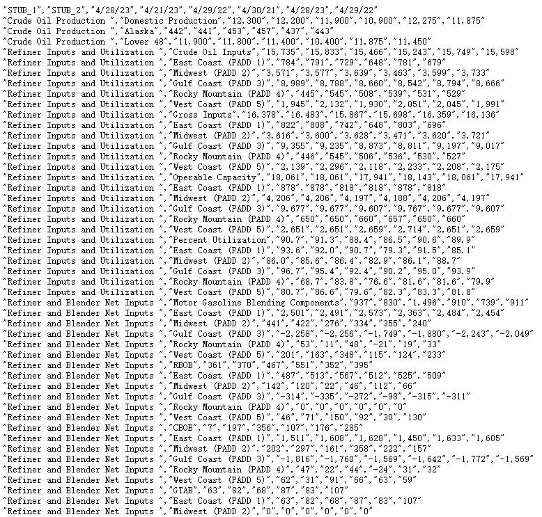

# EIA数据可视化自动更新项目

本项目主要利用R和Python脚本对EIA（美国能源信息署）的周度油品数据进行更新，并进行数据可视化处理，最终在微信中进行自动发送。

EIA周度源数据格式样本：

输出图片：

配置事项：

-   首先安装**R环境**和**python环境**

-   **00_0\_install_packages.R**为相关R包的安装文件，直接点击**00_0\_auto.bat**文件可安装相关包

-   **00_1\_history_web.R**为历史数据更新文件，在数据有较长时间未运行时，可用该文件进行补全，补全范围为距今5年的数据，直接点击**00_1\_auto.bat**可运行。 （注：抓取的网页为<https://www.eia.gov/petroleum/supply/weekly/archive/>，鉴于EIA官网对爬虫的限制，运行速度较慢）

-   **00_2\_update_web.R**为每周数据更新的主文件，主要生成完整的最新数据集（在*data*文件夹中），以及最新的图片（在*pic*文件夹中），点击**00_2\_auto.bat**可运行。（注：EIA周度数据每次第一时间更新都在<https://ir.eia.gov/wpsr/table9.csv>链接中）

-   **00_3\_send_pic.py**，**wxautov1.py**和**wxautov2.py**为python脚本下的微信自动发送脚本，使用时需要将微信聊天窗口打开方可运行，点击**00_3\_auto.bat**可运行。（注：**wxautov1.py**及**wxautov2.py**，均引用自<https://github.com/cluic/wxauto>的开源项目）

> 注意事项：
>
> 1.  安装R之后需要检查电脑环境变量中，R环境下的bin文件中的**Rscript.exe**有没有被添加，否则上述的bat文件都无法运行，只能通过打开**EIA_update_weekly.Rproj**，在RStudio中对相应文件进行运行。
> 2.  相关的python脚本可能会有失效的问题，最好在微信的PC版更新时进行测试。详情可以关注https://github.com/cluic/wxauto的开源项目
> 3.  EIA周度数据更新时间一般为**夏令时周三的22:30**或**冬令时周三的23:30**，相关.bat文件可根据需要，在对应系统的任务管理中进行配置，从而进行数据公布时的第一时间更新，并可针对不同系统进行修改，此处只给出了windows系统的方案。

## 2023.10.24 更新  
在R语言编写版本的基础上加入了python的数据更新部分，分为三个py脚本文件：
1. **01_eia_history.py**，该脚本主要针对历史数据的抓取类似于**00_1\_history_web.R**脚本文件的作用。
2. **02_eia_update.py**，该脚本主要用于生成可视化的表格，文件名为**eia_tab.png**。
3. **03_eia_plot.py**，该脚本主要用于生成最终的组图，文件名为**eia.png**。

图片生成如下：

> 注意事项：
> 
> 1. 目前绘制组图的模块**seaborn.objects**尚存许多待解决的问题，例如：不支持中文、线条的格式无法单独设定等等，还需要进一步更新。
> 2. 该添加版本可与之前发布的自动发送脚本进行整合，编译成相关**exe**文件，可自行运用**pyinstaller**进行操作。
